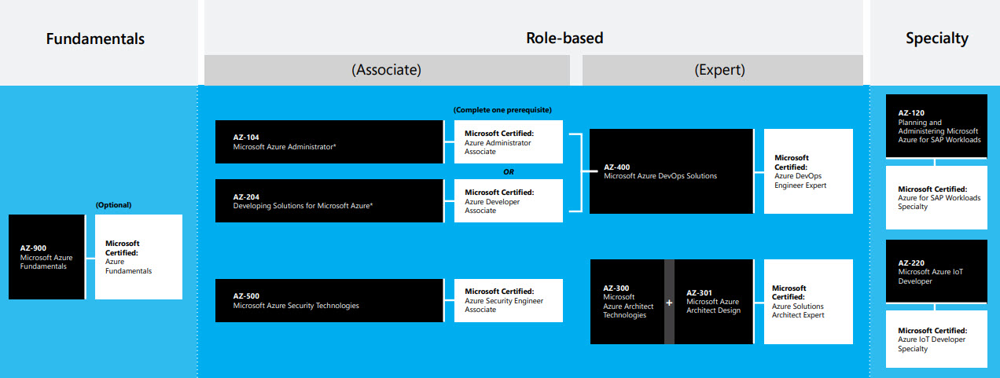

# MCP 시험 등록 절차와 Azure 인증 관련 정리 - v 0.5.1

이 페이지는 Microsoft Certified Professional (MCP) 시험 등록 절차와 Microsoft Azure 인증 시험 (AZ-XXX) 관련 정리 문서입니다.
 
수시로 업데이트되며 누구나 열람 할 수 있습니다.
  
응시한 개인 Microsoft 시험 성적증명서 확인은 [MCP.Microsoft.com](http://mcp.microsoft.com/)에서 확인 가능합니다.
 

**Microsoft Azure 인증 시험 목록** (마지막 업데이트 : **2020.05.11**)

| 번호 | 시험 번호 | 시험 이름 | 인증 이름 | 레벨 | 비고 |
| --- | --- | --- | --- | --- | --- |
| 01 | [AZ-900](https://docs.microsoft.com/ko-kr/learn/certifications/exams/az-900) | Azure 기초 | Azure Fundamentals | Fundamentals | 2020.05.28 업데이트 예정  |
| 02 | [AZ-103](https://docs.microsoft.com/ko-kr/learn/certifications/exams/az-103) | Azure 관리자 | Azure Administrator | Associate | 2020.06.30 만료 예정|
| 03 | [AZ-104(Beta)](https://docs.microsoft.com/ko-kr/learn/certifications/exams/az-104) | Azure 관리자 | Azure Administrator | Associate | 2020.3.31 Beta 출시 |
| 04 | [AZ-203](https://docs.microsoft.com/ko-kr/learn/certifications/exams/az-203) | Azure 솔루션 개발 | Azure Developer | Associate | 2020.05.31 만료 예정 |
| 05 | [AZ-204(Beta)](https://docs.microsoft.com/ko-kr/learn/certifications/exams/az-204) | Azure 솔루션 개발 | Azure Developer | Associate | |
| 06 | [AZ-300](https://docs.microsoft.com/ko-kr/learn/certifications/exams/az-204) | Azure 아키텍처 기술 | Azure Solutions Architect | Expert | 2020.07.28 만료 예정 |
| 07 | [AZ-301](https://docs.microsoft.com/ko-kr/learn/certifications/exams/az-301) | Azure 아키텍처 디자인 | Azure Solutions Architect | Expert | 2020.07.28 만료 예정 |
| 08 | [AZ-303(Beta)](https://docs.microsoft.com/ko-kr/learn/certifications/exams/az-303) | Azure 아키텍처 기술 | Azure Solutions Architect | Expert | 2020.4.28 Beta 출시 |
| 09 | [AZ-304(Beta)](https://docs.microsoft.com/ko-kr/learn/certifications/exams/az-304) | Azure 아키텍처 디자인 | Azure Solutions Architect | Expert | 2020.4.28 Beta 출시 |
| 10 | [AZ-400](https://docs.microsoft.com/en-us/learn/certifications/exams/az-400) | Azure 데브옵스 솔루션 | Azure DevOps Engineer | Expert | |
| 11 | [AZ-500](https://docs.microsoft.com/ko-kr/learn/certifications/exams/az-500) | Azure 보안 기술 | Azure Security Engineer | Associate | |
| 12 | [AZ-120](https://docs.microsoft.com/ko-kr/learn/certifications/exams/az-120) | Azure for SAP Workloads | Azure for SAP Workloads | Specialty | |
| 13 | [AZ-220](https://docs.microsoft.com/ko-kr/learn/certifications/exams/az-220) | Microsoft Azure IoT Developer | Azure IoT Developer | Specialty | Beta |

감사합니다.
